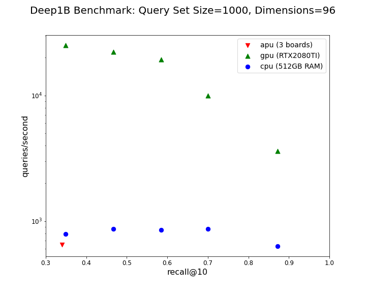

# Deep1B_Benchmark

This repository contains various useful benchmark tools and results for Sales and Marketing.

# Results

# How To Run This Code

* Install the Gemini APU software and install the Deep1B data clusters
* Mount the Sunnyvale NAS1 file server and copy the directory /mnt/nas1/George/Benchmarks/Deep1B_Benchmark_Data to your local machine
* Install Anaconda distribution of python
* Create and activate a python=3.8.5 environment.
* Use python 'pip' to install the packages using the requirements file [faiss-gpu_requirements.txt](faiss-gpu_requirements.txt)
* Edit the top of the file [benchmark_deep1B.py](benchmark_deep1B.py) and change the parameters for your setup
* Run the script [benchmark_deep1B.py](benchmark_deep1B.py).  Upon completion this will emit a CSV file with the benchmark data.
* Use the [Analysis.ipynb](Analysis.ipynb) notebook to load the CSV file, to produce a plot similar to the one above.
